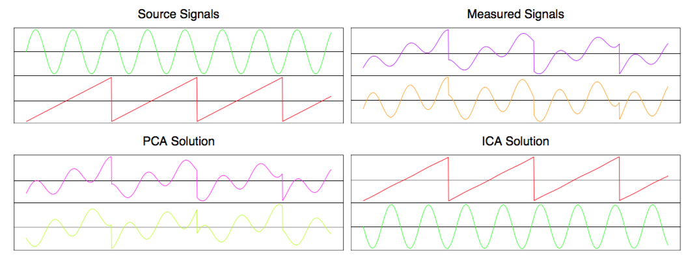
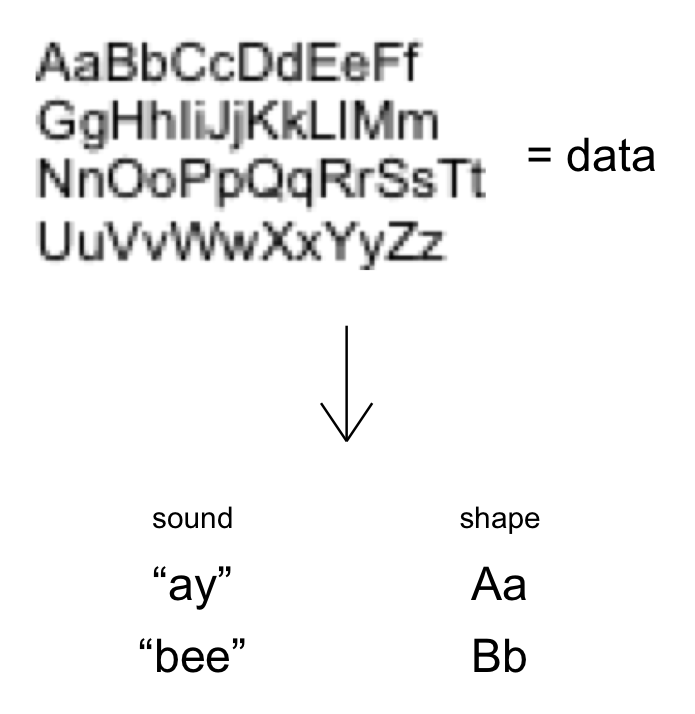

# [{{ page.title }}]({{ page.url }})

# Principle and Independent Component Analysis

Independent Component Analysis (ICA) is an unsupervised learning method, and if
you haven't heard of it, you've probably heard of its more famous cousin
Principle Component Analysis (PCA). PCA has a high ratio of usefulness to
mathematical difficulty, and it's often introduced as a paradigmatic example of
unsupervised learning. ICA is not as straightforward, but that also means it
seems even more like magic. Consider this picture from The Elements of
Statistical Learning [1]:

Clearly PCA is hopeless at separating the two signals, whereas ICA recovers them
perfectly. Given that PCA is usually presented alongside examples that clearly
illustrate its utility, and make PCA itself seem magical, this example only made
ICA seem even more mysterious and magical. Furthermore, I was wondering if it
was related to PCA--their names couldn't just be a coincidence, right? So I
decided to dive in and write up my thoughts here. But before we investigate ICA,
we should familiarize ourselves with its simpler cousin, PCA.

## Unsupervised learning

PCA is a form of unsupervised learning. I'm going to motivate PCA by first
discussing the rationale for unsupervised learning.

One way to think about unsupervised learning is as a _transformation process_.
You are given a bunch of data, and you want to transform it to another
representation, where you can "interpret" it better. What does "interpret" mean?
Well, the data will probably be "re-grouped" within this other representation of
the data. "Interpret" means that you assign some meaning to the groups within
this representation. In other words, you create a higher-level abstraction, and
use your label for that abstraction to stand for some of the data. You're using
something simple, like a word, to represent something unwieldy, like a
relationship between lots and lots of numbers.

You do this so that in the future, if you're reasoning at a higher level and
this abstraction happens to play a role, you can plug in your labeled data,
which you already used unsupervised learning to isolate.

Here's a concrete example of this: You're in kindergarten. The teacher is saying
something about an "alphabet", and shows you an image with weird drawings on it.
This is your data. You learn that there are 26 drawings, and you learn to tell
them apart. Then, your teacher creates the abstractions of the letters A-Z, and
helped you assign a label--the name of a letter--to each of the 26 different
shapes. This is you doing unsupervised learning. You're using something simple,
like the sound "ay", to stand for the up-pointing shape with a line through the
middle.

In first grade, let's say you need to write down your name. If you know that
your name starts with the letter A, you're all set. The unsupervised learning
you did in kindergarten means that you know what visual data corresponds to the
abstraction A--an up-pointing shape with a line through the middle. You draw
this on your paper, and then loop through the rest of the letters in your name.

## PCA in Words

Let's try to get more concrete, and move from talking about unsupervised
learning to PCA in particular. Above, I said unsupervised learning is a
transformation process. Given some data, you want to _transform_ it to another
_representation_. There are two avenues to making this statement more concrete:
answering "transform it how?" and answering "what criteria do you want this
other representation to have?"

The simplest thing to consider at first might be linear transforms. This means
that given some data, we're only going to transform it by multiplying the
numbers in that data by some constants, and/or adding the results of those
multiplications together. Another way to understand this is by representing each
data point as a vector, where the elements of the vector are the values of each
attribute of the data point (I'm assuming multi-dimensional data for this post).
By restricting yourself to linear transforms, you're saying that you're only
going to multiply this vector by a matrix, and use the same matrix for all your
data points. (The matrix itself can change depending on the entire data set,
though).

Next, we have to specify the characteristics we want the transformed
representation of the data to have. This is the interesting part. Behind many
transformations are assumptions: you act as though a certain scenario is true,
which allows you to actually do something to your data, and then when you're
finished transforming the data, you check to see if the output is actually
consistent with the assumptions you made in the beginning. This is also the case
for PCA.

We're going to assume that the data is generated by a number of 'sources'. Each
source outputs a signal that various measurement devices of ours pick up. You
can think of the reading of each measurement device as one element of our data.
For example, each 'source' could be the voice of certain people in a room, and
our measurement devices could be a series of microphones [2]. Each microphone is
placed in a different location in the room. Since every person is a different
distance from all of the microphones, each source is picked up in a unique way
by each of the microphones. Mathematically, a signal from a given source is
attenuated by a constant factor when it is picked up by a given microphone. For
a given source, the set of these factors tell you how our measurement devices
pick up its signal. If you consider the vector space where our data lives, this
set of factors picks out a unique direction in this space. If we knew this set
of factors, equivalent to a unit vector in this space, we could filter out the
contents of that signal from data that could have been generated by more than
one source.

In other words, if we just assume that the signal from every source is picked up
by a measurement device, after being scaled by a source- and measurement device-
dependent factor, and that signals from different sources merely add, then we
can use PCA to tell apart the signals from different sources.

To specify the criterion for the transformed representation, we need one more
innocuous-seeming assumption: that observing the signal from one source should
tell us absolutely nothing about the signal from another source. Surprisingly,
this requirement can be turned into the mathematical criterion we need.

In the scenario where we're trying to distinguish the voices of different people
in the same room by using the measurements of various microphones scattered
throughout the room, our criterion is that what Alice is saying has absolutely
nothing to do with what Bob is saying. In other words, by paying attention to
what Alice says, we are no better off in predicting what Bob is saying. The
signal from one source doesn't help us predict the signal from another source--
this is what is meant by "the sources are statistically independent".

How can we make this into something mathematical we can code up? By using the
language of probability. We're observing a signal $s_i^R$ from multiple sources
$s_i^R$. (Since these are random variables, I'm putting an $R$ next to them.) At
any given instant, the signals from every source can be combined into a vector
$\mathbf{s}^R$, where each element is one of the signals $s_i^R$. Think of the
vector $\mathbf{s}^R$ as being drawn from a multivariate probability
distribution $P(\mathbf{s}^R)$.

Now, the key point: if the sources were generating truly independent signals,
then the multivariate probability distribution $P(\mathbf{s}^R)$, from which you
draw a vector consisting of all the measurements, would _factorize_ into the
product of single-variable probability distributions for each source.
Mathematically,

\begin{equation}
P(\mathbf{s}^R) = P_1(s_1^R) \cdot P_2(s_2^R) \cdot\; \cdots\; \cdot P_m(s_m^R)
\end{equation}

where each $P_i$ is the probability distribution you draw from when measuring
the signal from source $i$, and where $m$ is the number of sources.

This suggests that the mathematical criterion we look for in the transformed
data is complete factorization of the joint probability distribution over the
variables $s_i^R$. However, although the criterion is now stated in terms of
math, it's not clear how to evaluate whether it's satisfied, much less look for
a transformation that satisfies the criterion. We'll see how to accomplish those
tasks when we get to implementing PCA and ICA.

## PCA in Math

**Let's get even more concrete, and describe the procedure in terms of linear
algebra.** We start with a bunch of $m$-dimensional data ($m$ was also the
number of sources). Let's make things simple and assume the dimensionality of
the data and the number of sources is the same, for now. Let's also assume that
the data points form a time series; in other words, you can arrange them in
order so that they represent a set of evenly spaced measurements taken $t$
seconds apart, where $t$ is an unknown but also unimportant constant. This
second assumption isn't necessary for the analysis below to hold, but it makes
things easier to interpret.

Each data point is a column vector $\mathbf{x}$ with $m$ elements. If we smash
our data points together, arranging the column vectors from left to right, we
get an $m \times n$ matrix $X$, called the design matrix. $n$ is the number of
data points we have. If you look at one row in the design matrix, it represents
the value of a particular measurement across data points; in our voice-
microphone setup described above, one row represents what a given microphone
picked up across all the data points. Since our data forms a time series, if we
arrange them in order to form $X$, we can think of one row as representing the
sound a given microphone picked up for the duration of our measurement.
Conversely, if you look at one column, it represents all measurements for a
single data point, so those numbers tell you what all the microphones picked up
at one given instant.

Remember how we planned to transform the data: through applying linear
transforms. Mathematically, this means that our transformed data can be
represented as

\begin{equation*}
\mathbf{S} = \mathbf{TX}.
\end{equation*}

$S$ is a matrix, analogous to the design matrix $X$, but where every row
represents (we hope) one of the sources. We've taken the rows of $X$ and swapped
microphones for voices. If we read across one row of $S$, we'll know exactly
what the signal from the source corresponding to that row was (equivalently,
what one of the voices was saying the whole time, without any interference from
the other voices). This is our goal.

All linear transformations can be represented by multiplying by a matrix, so $T$
is our transformation matrix. By necessity, its shape is $m\times m$. If you
think about the matrix multiplication, you can interpret $T$ as follows: if you
want to know about a certain source, find the row in $T$ (the same row as in
$S$) that corresponds to that source. To find the strength of the signal from
that source at the $i$th time point ($i$ goes from 1 to $n$, the number of
measurements), dot the vector represented by this row into the $i$th column of
$X$ (since $X$ is $m\times n$, the $i$th column also represents a vector of
length $m$). And if you want the complete signal from that source, dot the same
row into every column of $X$ and arrange the resulting numbers in order.

This means that each row of $T$ represents some linear combination of the
measurements picked up by each microphone. Weighing the measurements by the
entries in a given row yields the signal produced by the source corresponding to
that row of $T$. Each row of $T$ corresponds to one of the sources.

**Now that we have a starting point, how should we proceed?** Recall the second
criterion of our transformation procedure--we're assuming that all the sources
are "statistically independent". There's another mathematical consequence of
this that we didn't go into above. You may have heard of another word used to
describe variables that are supposed to be unrelated: "uncorrelated". People
often talk about how phenomena that are observed at the same time are
"correlated"--for example, rates of smoking and lung cancer are correlated. It
also crops up in the statement that "correlation and causation are not the same"
(but many times they both are present, as in the smoking example). In everyday
conversation people loosely use "correlation" to mean that if you see one of the
phenomena, the other will likely be present as well. But, mathematically,
"correlation" usually means "linear correlation" (this is what the "correlation
coefficient" $r$ measures).

The reason we chose to use the phrase "statistically independent" in our
criterion is because _it's more general than "linearly uncorrelated"_. In
particular, if two variables are statistically independent, it automatically
implies that they're linearly uncorrelated. But just because two variables are
linearly uncorrelated, doesn't mean that they're statistically independent.

However, it turns out that it's a little complicated to use the assume that the
sources are statistically independent. Let's just stipulate that our sources are
linearly uncorrelated for now. Mathematically, this means that

\begin{equation*}
\mathrm{Cov}(\mathbf{s}_i,\mathbf{s}_j) = 0
\end{equation*}

for every pair $i, j$ (except when $i=j$, which won't be 0 unless the signal
from that source is itself 0). Can we use this equation to help us? Almost.
Let's unpack the $\mathrm{Cov}()$ function:

\begin{equation*}
\mathrm{Cov}(\mathbf{s}_i, \mathbf{s}_j) = \langle \mathbf{s}_i\mathbf{s}_j
\rangle - \langle \mathbf{s}_i \rangle \langle \mathbf{s}_j \rangle
\end{equation*}

Now we'll fill in some values. We just said above that
$\mathrm{Cov}(\mathbf{s}_i,\mathbf{s}_j) = 0$, so let's replace the left side
with 0:

\begin{equation*}
0 = \langle \mathbf{s}_i\mathbf{s}_j \rangle - \langle \mathbf{s}_i \rangle
\langle \mathbf{s}_j \rangle
\end{equation*}

Rearranging, we can write

\begin{equation*}
\langle \mathbf{s}_i\mathbf{s}_j \rangle = \langle \mathbf{s}_i \rangle \langle
\mathbf{s}_j \rangle
\end{equation*}

Can we use this equation to help us develop an expression for $S$ or $T$? Yes.
The $\mathbf{s}_i$ and $\mathbf{s}_j$ that appear above are just the different
rows of $S$, and the expression $\langle \mathbf{s}_i\mathbf{s}_j \rangle$ is
essentially (but not exactly) a dot product between different rows of $S$. The
only other equation we have is $S = TX$, so we need to get dot products between
rows of $S$ to appear in this equation. Fortunately, that's exactly what right-
multiplying by the transpose of a matrix does, so we'll do that to both sides.

\begin{equation*}
SS^T = (TX)(TX)^T = (TX)(X^TT^T) = TXX^TT^T
\end{equation*}

Look at the term $SS^T$. Since $S$ is $m\times n$, $SS^T$ is an $m\times m$
matrix where each entry is a dot product between two of the rows of $S$. In
other words, the innards of $SS^T$ look like this:

\begin{equation*}
SS^T =
\begin{pmatrix}
\mathbf{s}_1\bullet \mathbf{s}_1 & \mathbf{s}_1\bullet \mathbf{s}_2 &
\mathbf{s}_1\bullet \mathbf{s}_3 & \cdots \\ \mathbf{s}_2\bullet \mathbf{s}_1 &
\mathbf{s}_2\bullet \mathbf{s}_2 & \mathbf{s}_2\bullet \mathbf{s}_3 & \cdots \\
\mathbf{s}_3\bullet \mathbf{s}_1 & \mathbf{s}_3\bullet \mathbf{s}_2 &
\mathbf{s}_3\bullet \mathbf{s}_3 & \cdots \\ \vdots & \vdots & \vdots & \ddots
\end{pmatrix}
\end{equation*}

Now, what's the difference between $\mathbf{s}_1 \cdot \mathbf{s}_2$ and $
\langle \mathbf{s}_1\mathbf{s}_2 \rangle$? To review, the former actually is a
dot product, like in physics: it means you do element-wise multiplication of the
two vectors, and add the results up to get one number.

\begin{equation*}
\mathbf{s}_1 \bullet \mathbf{s}_2 = \sum_{i=1}^n \mathbf{s}_1[i] \cdot
\mathbf{s}_2[i]
\end{equation*}

The latter is an average, like in statistics:

\begin{equation*}
\langle \mathbf{s}_1 \mathbf{s}_2 \rangle = \frac{1}{n} \sum_{i=1}^n
\mathbf{s}_1[i] \cdot \mathbf{s}_2[i]
\end{equation*}

The only difference between the two is an extra factor of $\frac{1}{n}$ in
$\langle \mathbf{s}_1 \mathbf{s}_2 \rangle$. So we can convert $\mathbf{s}_1
\bullet \mathbf{s}_2$ into $\langle \mathbf{s}_1 \mathbf{s}_2 \rangle$ by
pulling out a factor of $n$:

\begin{equation*}
SS^T = n \cdot
\begin{pmatrix}
\langle \mathbf{s}_1 \mathbf{s}_1\rangle & \langle \mathbf{s}_1
\mathbf{s}_2\rangle & \langle \mathbf{s}_1 \mathbf{s}_3\rangle & \cdots \\
\langle \mathbf{s}_2 \mathbf{s}_1\rangle & \langle \mathbf{s}_2
\mathbf{s}_2\rangle & \langle \mathbf{s}_2 \mathbf{s}_3\rangle & \cdots \\
\langle \mathbf{s}_3 \mathbf{s}_1\rangle & \langle \mathbf{s}_3
\mathbf{s}_2\rangle & \langle \mathbf{s}_3 \mathbf{s}_3\rangle & \cdots \\
\vdots & \vdots & \vdots & \ddots
\end{pmatrix}
\end{equation*}

Now we can use the equation $\langle \mathbf{s}_i\mathbf{s}_j \rangle = \langle
\mathbf{s}_i \rangle \langle \mathbf{s}_j \rangle$ to simplify the matrix. But
remember that that equation is true only when $i$ and $j$ are different. When
$i$ and $j$ are the same, this term becomes the average of the square of
$\mathbf{s}_i$. Now the matrix looks like

\begin{equation*}
SS^T = n \cdot
\begin{pmatrix}
\langle \mathbf{s}_1^2 \rangle & \langle \mathbf{s}_1\rangle \langle
\mathbf{s}_2\rangle & \langle \mathbf{s}_1 \rangle \langle \mathbf{s}_3\rangle &
\cdots \\ \langle \mathbf{s}_2\rangle \langle \mathbf{s}_1\rangle & \langle
\mathbf{s}_2^2\rangle & \langle \mathbf{s}_2\rangle \langle \mathbf{s}_3\rangle
& \cdots \\ \langle \mathbf{s}_3 \rangle \langle \mathbf{s}_1\rangle & \langle
\mathbf{s}_3 \rangle\langle \mathbf{s}_2\rangle & \langle \mathbf{s}_3^2 \rangle
& \cdots \\ \vdots & \vdots & \vdots & \ddots
\end{pmatrix}
\end{equation*}

Can we massage this matrix any further? Are there any further assumptions we can
make about the data or the sources that will let us progress? Well, notice that
the off-diagonal terms are products involving all the means $\langle
\mathbf{s}_i \rangle$ of the sources. What we can do is to set all of the means
to 0.

You mighte be suspicious about making this simplification, since the mean seems
like a pretty important piece of information about a signal. But if you take the
point of view of physically making measurements, you'll realize that you're
always measuring a signal relative to some baseline level of noise. Subtracting
that constant noise from your measurements corresponds to shifting the mean of
the measured signal, and this is something you or your measurement devices do
all the time.

If we set all the means $\langle \mathbf{s}_i \rangle$ to 0, the off-diagonal
terms in the matrix become 0. We end up with

\begin{equation*}
SS^T = n \cdot
\begin{pmatrix}
\langle \mathbf{s}_1^2 \rangle & 0 & 0 & \cdots \\ 0 & \langle
\mathbf{s}_2^2\rangle & 0 & \cdots \\ 0 & 0 & \langle \mathbf{s}_3^2 \rangle &
\cdots \\ \vdots & \vdots & \vdots & \ddots
\end{pmatrix} = TXX^TT^T
\end{equation*}

Notice that this matrix is diagonal. That means we can interpret T as a matrix
that rotates $XX^T$ to a new basis where it becomes diagonal. In other words, to
find $T$, the transformation matrix, we need to diagonalize $XX^T$. Now the
problem is reduced to a familiar procedure.

Once $XX^T$ is diagonalized, we can use its eigenvectors to reassemble the
matrix $T$. Then, all we need to do is multiply the design matrix $X$ by $T$,
and we'll have recovered the sources, accomplishing our goal.

## PCA in Code

In Python, the code to implement PCA is quite simple:


import numpy as np
import numpy.linalg as la

def pca(X):
    """Computes the source signals that could have produced
    the measured signals X, represented as a matrix where
    columns correspond to data points and rows to features."""
    _, T = la.eigh(X.dot(X.transpose()))
    return T.transpose().dot(X)


Let's take a look at an 2-dimensional example we can visualize.

---

### References

[1] Hastie, Tibshirani, Friedman, The Elements of Statistical Learning

[2] Shlens, A Tutorial on Independent Component Analysis, arXiv:1404.2986v1

 
[Source Notebook File](https://github.com/gte620v/gte620v.github.io/tree/master/_ipynb/ICA.ipynb)
